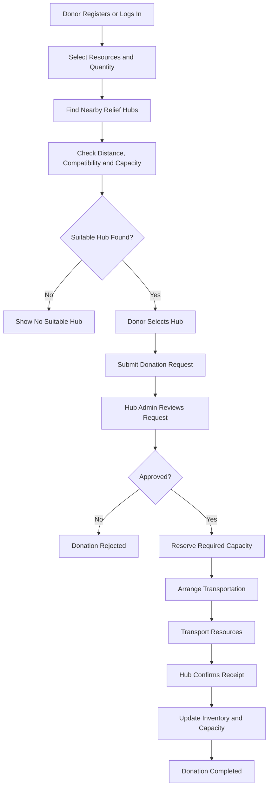
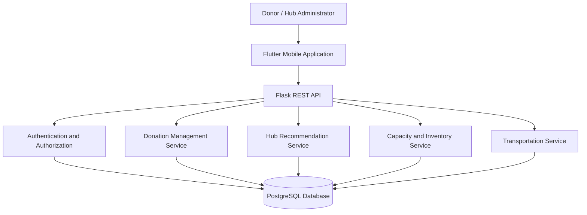

# RESQ — Disaster Relief Resource Donation & Hub Coordination Platform

**From willing donors to ready relief hubs.**

RESQ is a disaster-relief resource coordination platform designed to connect donors with nearby relief hubs based on geographical proximity, resource compatibility, and available storage capacity. It aims to make physical resource donations more organized, transparent, and efficient during disasters and humanitarian emergencies.

---

## 1. Problem Statement

During natural disasters such as floods, earthquakes, cyclones, and landslides, individuals, communities, NGOs, and organizations often come forward to donate essential resources.

However, coordinating these donations with the appropriate relief hubs can be challenging.

Some hubs may receive more supplies than they can store, while other hubs may lack essential resources. Donors may also struggle to identify suitable collection points and determine whether their donations can be accepted.

The absence of a coordinated donation workflow can contribute to delays, resource misallocation, and avoidable wastage.

**The core problem:** How can we connect available physical resources with suitable relief hubs while considering distance, acceptance requirements, and available storage capacity?

## 2. Our Solution

RESQ proposes a centralized platform that streamlines the physical resource donation process.

Instead of simply displaying nearby collection centres, RESQ aims to recommend suitable hubs based on the type and quantity of resources being donated, their geographical location, and the hub's available capacity.

The platform also introduces an administrator approval process, capacity reservation, transportation coordination, and inventory tracking.

Our goal is to improve coordination between donors and relief organizations through a structured, trackable workflow.

## 3. Key Features

### Capacity-Aware Hub Recommendations

* Identify nearby registered relief hubs.
* Calculate approximate distances using geographical coordinates.
* Filter hubs according to the resources they accept.
* Recommend hubs with sufficient available capacity for the proposed donation.

### Physical Resource Donations

* Support donations such as clothes, blankets, drinking water, food packets, hygiene kits, and other essential supplies.
* Capture resource category, quantity, unit, condition, and relevant details.
* Associate each donation with a selected relief hub.

### Hub Administrator Approval

* Allow authorized hub administrators to review donation requests.
* Approve or reject requests based on capacity and resource requirements.
* Prevent unauthorized users from making administrative decisions.

### Capacity Reservation

* Reserve appropriate storage capacity when a donation is approved.
* Track occupied, reserved, and available capacity separately.
* Reduce the risk of accepting more donations than a hub can accommodate.

### Flexible Transportation Coordination

* Allow transportation to be coordinated by either the donor or hub administrator.
* Record scheduling details and transportation status.
* Track progress from arrangement to delivery.

### Inventory and Donation Tracking

* Maintain records of resources received by each hub.
* Update inventory after receipt is confirmed.
* Allow donors to track the status of their donations.

---

## 4. How RESQ Works

The proposed workflow follows these steps:

1. **Donate:** A user lists the physical resources they wish to contribute.
2. **Discover:** RESQ identifies nearby hubs that accept the requested resources.
3. **Match:** The system evaluates distance and available capacity to recommend suitable hubs.
4. **Select:** The donor chooses a preferred relief hub.
5. **Approve:** The hub administrator reviews and approves or rejects the donation request.
6. **Coordinate:** The donor or administrator arranges transportation.
7. **Deliver:** The resources are transported to the selected hub.
8. **Confirm:** The hub administrator confirms receipt.
9. **Update:** The system updates the hub's inventory and capacity records.

### Workflow Diagram

---

## 5. What Makes RESQ Different?

RESQ focuses on coordinating the donation lifecycle rather than functioning as a basic donation listing application.

| Conventional donation approach                       | Proposed RESQ approach                                 |
| ---------------------------------------------------- | ------------------------------------------------------ |
| Lists donation collection points                     | Recommends suitable hubs using distance and capacity   |
| May not reflect a hub's current storage availability | Considers available capacity before recommending a hub |
| Relies on informal communication for acceptance      | Includes a structured administrator approval process   |
| Tracks donations informally                          | Maintains donation statuses and transaction history    |
| Handles transportation separately                    | Records transportation responsibility and progress     |
| Inventory visibility may be limited                  | Tracks hub inventory and capacity updates              |

**Our core differentiator:** Capacity-aware hub matching combined with administrator approval, storage reservation, transportation coordination, and receipt-based inventory updates.

These features are intended to work together as a unified workflow.

---

## 6. Target Users

**Donors**

* Individuals
* Local communities
* Educational institutions
* Corporate and community donors

**Relief Organizations**

* NGOs
* Disaster-relief organizations
* Registered collection centres
* Community relief groups

**Hub Administrators**

* Manage hub information and storage capacity.
* Review donation requests.
* Coordinate transportation.
* Confirm received resources and maintain inventory.

---

## 7. Proposed Technology Stack

| Component                  | Technology                               | Purpose                                                     |
| -------------------------- | ---------------------------------------- | ----------------------------------------------------------- |
| Frontend                   | Flutter                                  | Cross-platform mobile application                           |
| Backend                    | Python, Flask                            | REST API and application logic                              |
| Database                   | PostgreSQL                               | Persistent storage of users, hubs, donations, and inventory |
| Local development database | SQLite                                   | Simplified development and testing                          |
| Authentication             | JWT                                      | Secure authentication and API access                        |
| ORM                        | Flask-SQLAlchemy                         | Database models and queries                                 |
| Geolocation                | Latitude/longitude and Haversine formula | Distance calculation and nearby hub discovery               |
| API communication          | REST APIs and JSON                       | Frontend-backend integration                                |
| Testing                    | pytest                                   | Backend functionality and business-rule testing             |

*This is the proposed architecture. Individual components and features will be marked as implemented as development progresses.*

---

## 8. Proposed System Architecture

RESQ follows a modular client-server architecture.

### Architecture Overview

* **Presentation layer:** Provides interfaces for donors and hub administrators.
* **API layer:** Handles incoming requests and returns structured responses.
* **Business logic layer:** Processes donation requests, hub matching, approvals, and transportation updates.
* **Data layer:** Stores user accounts, hub information, donations, capacity, inventory, and status history.
* **Security layer:** Enforces authentication, role-based authorization, and access restrictions.

---

## 9. Capacity Management Logic

Capacity management is an important part of RESQ.

A hub should not be recommended merely because it is geographically close. It must also accept the resource category and have sufficient available capacity.

The proposed calculation is:

**Available capacity = Total capacity − Occupied capacity − Reserved capacity**

For example, consider a relief hub with a total storage capacity of 1,000 litres-equivalent units.

* Total capacity: 1,000 units
* Occupied capacity: 500 units
* Reserved capacity: 200 units
* Available capacity: 300 units

A proposed donation requiring 250 units of storage could fit, provided the hub accepts the resource and all other eligibility checks pass.

A donation requiring 400 units would not qualify for this hub.

*These figures are illustrative. In the implementation, capacity must use consistent physical units or documented resource-specific volume estimates. Item counts and storage volume must not be treated as interchangeable.*

After an administrator approves a donation, the required capacity is reserved. When receipt is confirmed, the reservation is released and actual occupied capacity and inventory are updated.

---

## 10. Security and Reliability

The proposed system will incorporate:

* Secure password hashing.
* JWT-based authentication.
* Role-based permissions for donors and hub administrators.
* Hub-level access restrictions for administrative operations.
* Input validation for donation quantities, locations, and resource categories.
* Database transactions for approval, capacity reservation, and inventory updates.
* Donation status validation to prevent invalid transitions.
* Audit records for significant administrative and inventory actions.

These controls aim to improve accountability and maintain consistent donation records.

---

## 11. Expected Impact

RESQ aims to contribute to more organized disaster-relief resource distribution.

Expected benefits include:

* Improved visibility into available relief-hub capacity.
* Better matching of donated resources with suitable collection hubs.
* Reduced risk of hub overcapacity and avoidable resource wastage.
* More structured communication between donors and relief organizations.
* Greater traceability of donation approval and delivery.
* Improved coordination of physical resources during relief operations.

These are intended outcomes; their actual impact will need to be evaluated through testing and practical deployment.

---

## 12. Scope and Future Enhancements

### Initial Scope

* User authentication and role management.
* Relief hub registration and capacity records.
* Resource donation submission.
* Nearby hub recommendations.
* Administrator approval and rejection.
* Capacity reservation.
* Transportation coordination.
* Receipt confirmation and inventory updates.

### Future Enhancements

* Live hub capacity synchronization.
* Push notifications for donation status changes.
* Map-based hub discovery.
* Multilingual interfaces.
* Analytics for resource demand and distribution.
* Integration with verified NGO and relief-organization data.
* Disaster-specific resource prioritization.
* Optional AI-assisted demand analysis when reliable data is available.

---

## 13. Current Development Status

**Project stage: Initial evaluation / prototype development**

The project is being developed around the core workflow of physical resource donation, capacity-aware hub discovery, administrator approval, transportation coordination, and inventory tracking.

The following checklist should be updated as features are actually completed and tested:

* [ ] Frontend donor interface
* [ ] User authentication and role management
* [ ] Relief hub registration and management
* [ ] Capacity-aware hub recommendations
* [ ] Donation request workflow
* [ ] Hub administrator approval
* [ ] Capacity reservation logic
* [ ] Transportation coordination
* [ ] Receipt confirmation and inventory updates
* [ ] Backend integration tests
* [ ] End-to-end prototype demonstration

---

## 14. Team and Project Information

* **Project Name:** RESQ
* **Domain:** Disaster Management, Social Impact, Resource Coordination
* **Project Type:** Hackathon Prototype
* **Primary Objective:** Improve coordination of physical resource donations during disasters.
* **Repository:** Add your GitHub repository link here.
* **Team Members:** Add your team members here.
* **Institution:** Add your college name here.

---

## Conclusion

RESQ aims to bridge the gap between people willing to donate essential resources and relief hubs capable of receiving and distributing them.

By combining location-based discovery, resource compatibility, capacity-aware recommendations, administrator approval, transportation coordination, and inventory tracking, RESQ proposes a more structured approach to disaster-relief resource management.

**RESQ — From willing donors to ready relief hubs.**
